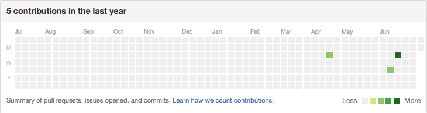
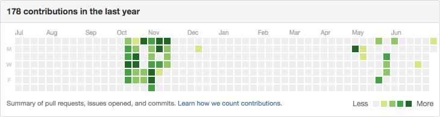
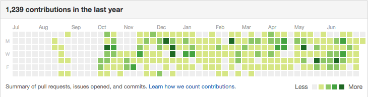

# Curating Your Github

## Getting the Green: Keep Your Github Impressive

A common practice among technical recruiters is to look through your Github profile.  You're especially likely to be subject to this as a bootcamp grad.  Why?  Because as someone who is new to software development and who has never worked professionally, your Github provides the only evidence of your competence as a developer.  Employers want to see that you're staying sharp even after a/A ended, and that you're enthusiastic enough about coding to keep doing it outside of the classroom.

As with most of your application materials, recruiters will likely only take a brief look at your Github.  It's unlikely that anyone will dig deeply into your code -- an engineer who's about to interview you may look at a few files in a repository or two, but usually not.  More often, an employer will hop onto your Github, look at your **green squares**, and may take a look at your Readmes for the first couple repositories that appear.  

### Green Squares

As you know by now, Github records the frequency with which you commit by showing green squares on your Contribution History.  This is by no means a perfect measure of how much you're coding, but it's an easy one for recruiters, so they use it.  Compare these three Github histories:

Which person would you interview, all else being equal?  To make your profile green:
- Commit everyday, and commit often during the day
- Change your settings to show both private and public contributions, especially if any of your repositories are private (NOT recommended during the job search) or if you're contributing to someone else's project

## Make it personal
* A strongly branded Github is more welcoming and tells employers you
  care about the code you publish.    
* Add your first name and last name under *settings > profile*. This
  makes it easier for employers to find you and review your code.    
* Make sure you have a profile picture and that you're recognizable on
  it. This is an easy way to strengthen the connection with employers who review your code, and to make sure they remember who you are after interviewing you.

## Merge and format
* Merge most of your repositories into one.
    * The very early ones.
    * Very incomplete projects.
* Rename the repos that you keep.
    * Give them enticing descriptions and useful ReadMe's.
    * Make sure to remove all lines of code that you'd commented out.
      * The `git grep` command is your friend.
    * Do this in your browser so that their last commit is from you and not 'App Academy Student'.

## Cool Repos to Keep
* ActiveRecord Lite
* Rails Lite
* Asteroids
* Snake
* Tic-Tac-Toe & Tower of Hanoi
* Ruby recursion exercises (if they're complete)
* BFS, DFS, Knight's Travails, 8 Queens, Word Chains

In the post-course curriculum you will learn about data structures and algorithms.
You will implement linked lists, binary trees, hashes, etc. in Ruby.
These implementations are actually rare in Ruby, so these are cool things to have.
Keep them in explicitly named repos, eg. "Ruby Linked List". Employers will <3.

### READMEs

Every project you have on your Github should have a Readme.  Pay special attention to the Readmes of projects that appear on your resume.  Some things to include in your Readmes:

- An overview of the project -- its purpose and features
- The technologies you used to create the project
- Details of a couple of the most interesting features -- how did you implement it?  What obstacles were difficult to overcome?  Include screenshots and code snippets throughout.
- Directions you'd like to take the project in the future

Read more about [Readmes][readme].

### Starred Repos

You want to draw a recruiter's attention to your best work whenever possible.  On Github, one way to do this is to star and/or pin your repositories -- that will make them show up at the top of your Github popular repo list.  In the event that a recruiter does click past your profile page, it's more likely to be on a project you're proud of.  

## Show How Active You Are

Star some other repos and follow a few people. Good repos to star would be Rails,
RSpec, Backbone, and anything you've used. You can follow the major contributors
to these repos and everybody in class (including instructors). If you all follow
each other, you'll also have followers!

## [How to write a README][readme]

[readme]: ../../projects/example-readmes.md
