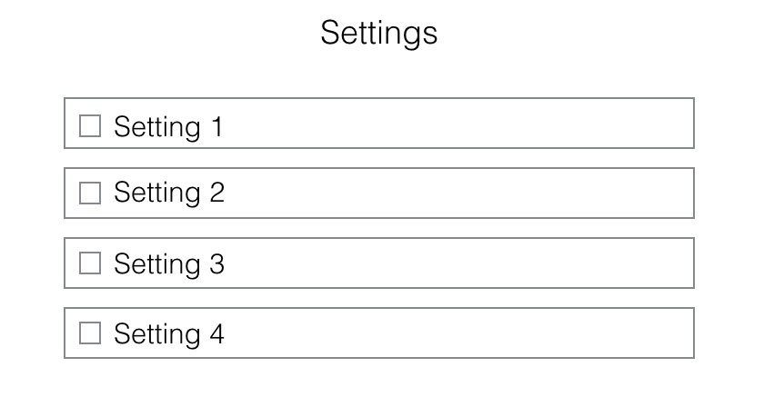

## Color Corrector

### Background

**NB**: Because your flex project is the most original of the three, your background section may be longer than on other projects.

Colorblindness and other visual impairments can make the internet difficult to use.  This Chrome extension will replace colors with appropriately contrasted colors or contrasted grey scale, depending on the user's settings.  Additionally, it will add underline to links on the page, in case links are delineated only by color.  

Developers and designers may also be interested in knowing how colors affect visually impaired users. This extension will provide features that simulate colorblindness of varying degrees so that professionals can see how these users are experiencing their site.  

Development of the features in this extension will be guided by [Usability.gov](https://www.usability.gov/get-involved/blog/2010/02/color-blindness.html), [99Designs](https://99designs.com/blog/tips/designers-need-to-understand-color-blindness/), and [We Are Colorblind](http://wearecolorblind.com).

### Functionality & MVP

With this extension, users will be able to:

- [ ] Convert all colors on a webpage to high-contrast gray scale,
- [ ] Toggle the link underliner,
- [ ] Convert all colors to high-contrast,
- [ ] Convert all colors to grey scale as a totally colorblind user would see it,
- [ ] Convert all colors to low-contrast, as a mildly colorblind user would see it.

### Wireframes

### Technologies & Technical Challenges

This extension will be implemented using the standard Chrome extension technology: Javascript, HTML, and CSS.  In addition to the `manifest.json` and `package.json` files, there will be two scripts:

- `content.js`: will contain the logic for finding and recoloring elements in the DOM
- `options.js`: will contain the logic for changing the user's settings

There will also be two HTML files to display the content:

- `new_style.css`: the file containing the styling rules for recoloring
- `options.html`: the file that renders the Settings menu for the user

The primary technical challenges will be:

- Identifying all the colors used on the DOM elements,
- Determining which grey scale tone corresponds to each color -- this will be different depending on whether the user requires high contrast or not
- Determining which high-contrast colors should be used to replace the existing colors, when the extension is in high contrast color mode

The colors will be identified by mapping classes in the DOM to a variety of attributes in the CSS such as `color`, `background-color`, and perhaps others.  Going from color to grey scale will be done with a standard algorithm.  Going from color to high-contrast color will be more challenging: currently, I plan to utilize a subset of high-contrast colors and map the given colors via some distance algorithm to the best match for these colors.  

### Implementation Timeline

**Day 1**: Get started on the infrastructure of the extension, following [this guide](https://developer.chrome.com/extensions/getstarted) from Chrome.  By the end of the day, I will have:

- A completed `package.json`
- A completed `manifest.json`
- The ability to locate and alter a DOM element by class

**Day 2**: Work on identifying the colors used in the DOM by class and other attributes, and create and render a new DOM with different colors.  By the end of the day, I will have:

- The ability to identify all colors
- A new HTML file that gets rendered in place of the current DOM, using different colors

**Day 3**: Dedicate this day to correctly replacing colors with their grey scale or high-contrast equivalents.  By the end of the day:

- Implement an algorithm for replacing colors with grey scale tones
- At least understand (and hopefully implement) and algorithm for replacing colors with high-contrast equivalents
- Render a new DOM that contains each of these color equivalents

**Day 4**: Create the settings page and connect the settings to the color change logic.  If time, create high-contrast grey scale and low-contrast algorithms as well.  By the end of the day:

- Fully implemented settings changes that re-render a differently colored DOM
- If time, implement the final two features: normal color to low contrast and normal to high-contrast grey scale

