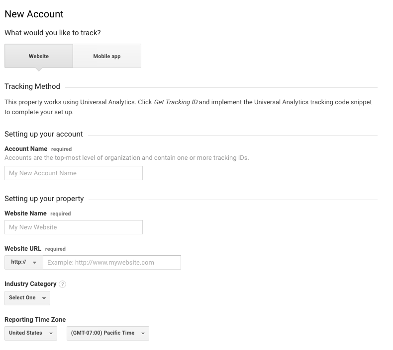
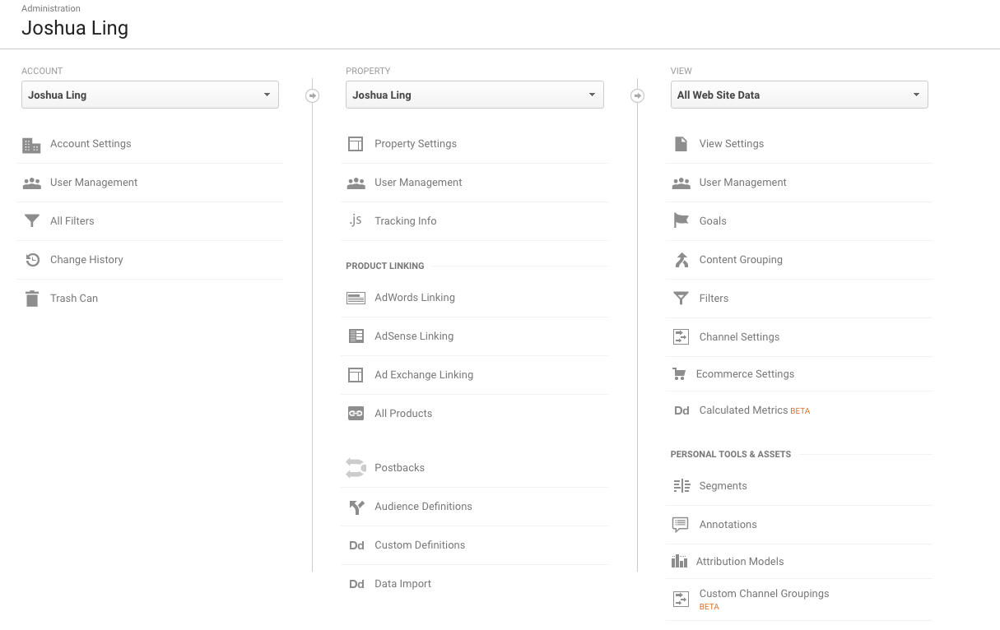
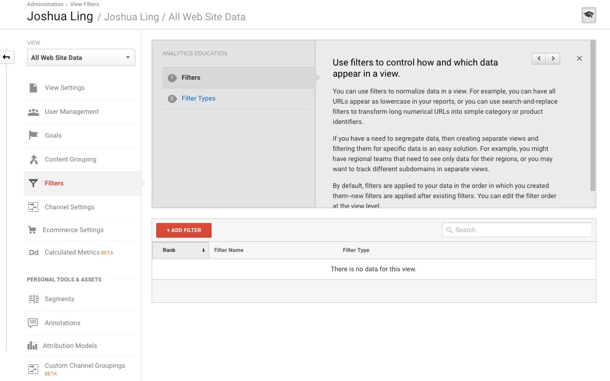
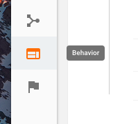

### Google Analytics Sparknotes Version

Go **[here](./google-analytics-reading.md)** for a more in-depth breakdown of Google Analytics and some of its useful features. **(highly recommended)**

#### Why Google Analytics?
Job search is a super murky process. At times, you feel like you're just sending out applications into the void, not sure if anyone is even looking at your resume, much less your projects.

Putting Google Analytics on your projects will give us more information to work with. For example, if your projects are getting several hits, but you're not getting responses from companies, then that might be a clue for you to boost up your projects to make them more impressive.

On the other hand, if your projects are getting absolutely no views, then that might be an indication that with your current resume, you're getting screened before the recruiter is even interested in opening up the projects.

#### Quick Setup
1. Go to https://analytics.google.com/analytics/web  and sign up:

  * For 'Account Name', just put your own name (ie. 'Joshua Ling').
  * Under 'Setting up your property', for 'Website Name', you can also just put your name because you can end up using this one 'property' for all of your projects.
  * For the Website URL, go ahead and just choose one of your projects. This field does not affect what ends up getting tracked by Analytics.

2. Once you sign up for an account, you should be taken to a page that looks like this:

  * Under where it says 'Website tracking', copy and paste that script into the head of all of your projects in the index.html file. Again, I want to reiterate that you do not need to create a new property for each project; one property and its script tag will work for all of them (more on this later).

3. Then, please share collab access with your coach so that they can also look at the data and perhaps share their advice. Do this by clicking on the gear icon on the bottom left corner:

  * Hitting the gear icon takes you to this view:

  * Under the middle column, 'Property', click on 'User Management'.
  * Then, in the 'Add permissions for:' field, please put your coach's email.
  * And then, check 'Notify this user by email'

4. Finally, filter out your own IP address so you don't end up tracking your own views as well. Do this by clicking the gear icon on the bottom left corner again. Then, on the right most column, labeled 'View/All Web Site Data', click 'Filters', which should take you to this view:

  * Click "Add Filter"
  * Name the Filter
  * For 'filter type', choose "Exclude"
  * Choose "traffic from the IP addresses"
  * Choose "that are equal to"
  * Paste in your IP address (Google: "What's my IP address?")
  * Also, add App Academy's IP address (66.162.144.78)
  * Another option could be to add this [Chrome Extension](https://chrome.google.com/webstore/detail/google-analytics-opt-out/fllaojicojecljbmefodhfapmkghcbnh)

#### Viewing the Data
* Finally, to view the data breakdown between your different projects, go to the left hand column and click on the 'behavior' icon:

* Click on 'Site Content', and then 'All Pages', which leads you to this view:

* For 'Primary Dimension', click on 'Page Title', which should then get you a breakdown of how many views each of your projects are getting.

For a more detailed breakdown of what each of the fields mean, please refer to the [more in-depth Google Analytics reading](./google-analytics-reading.md)
