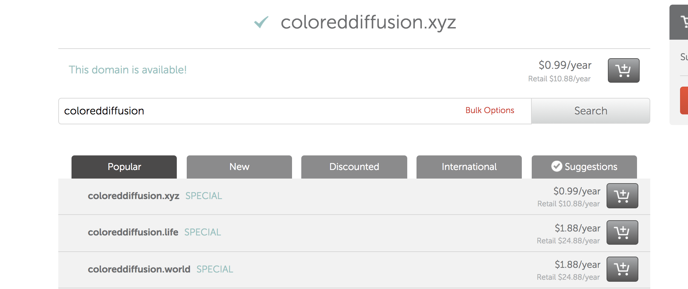
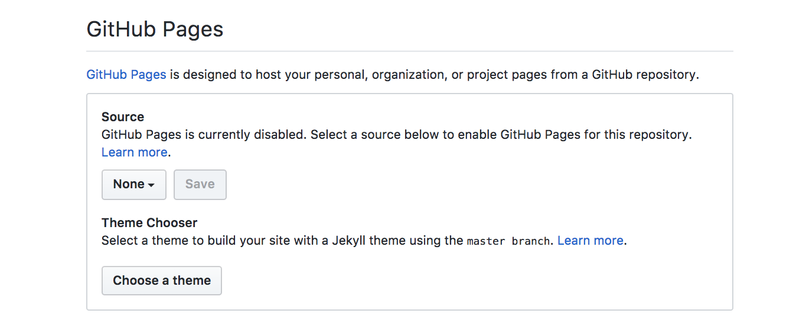
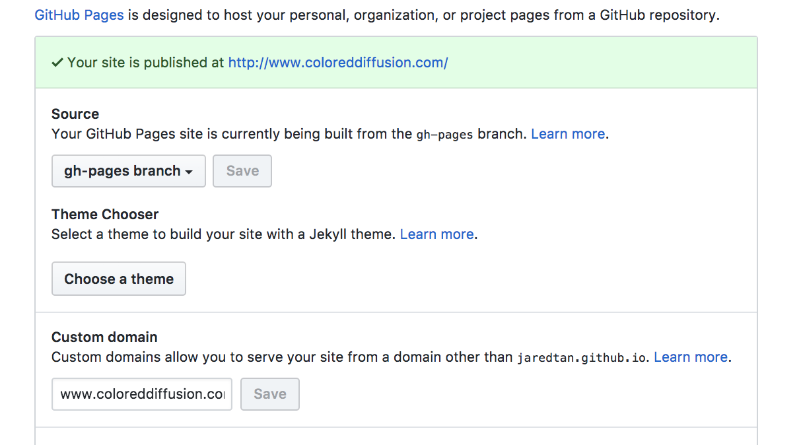
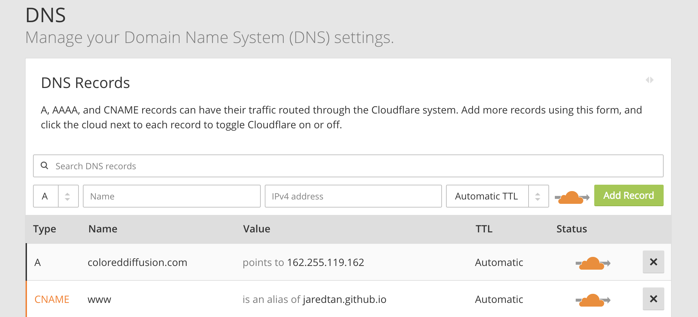
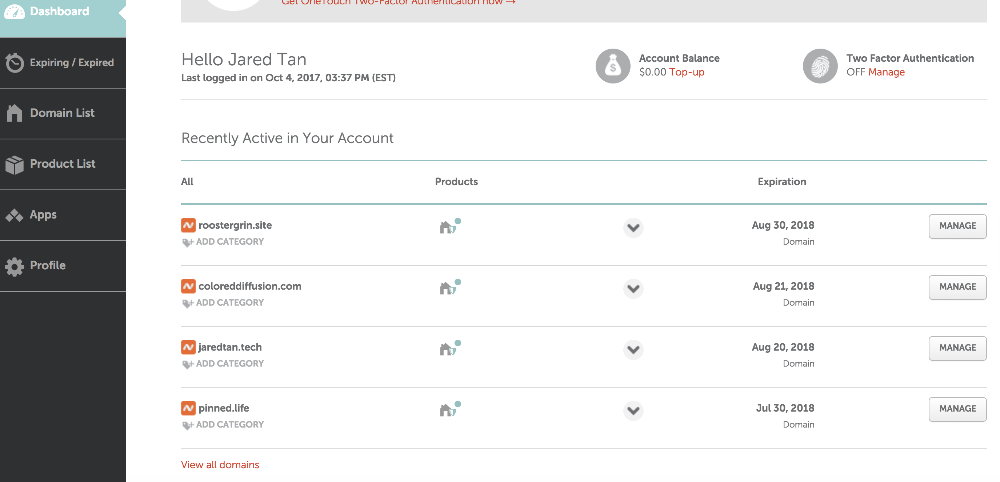
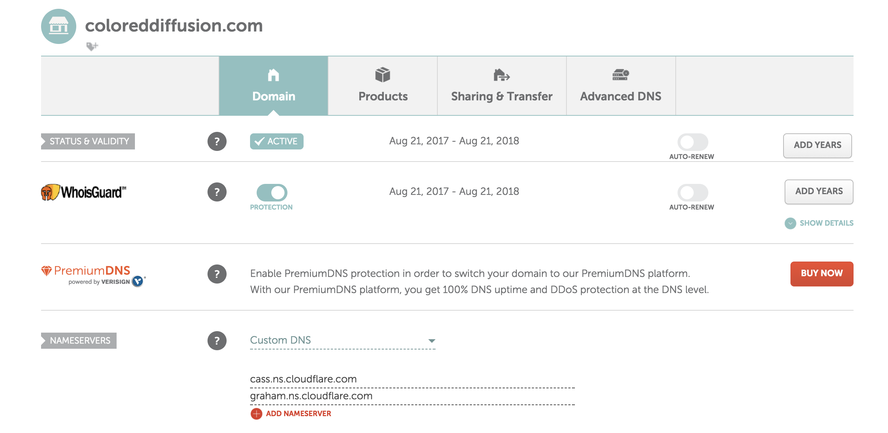
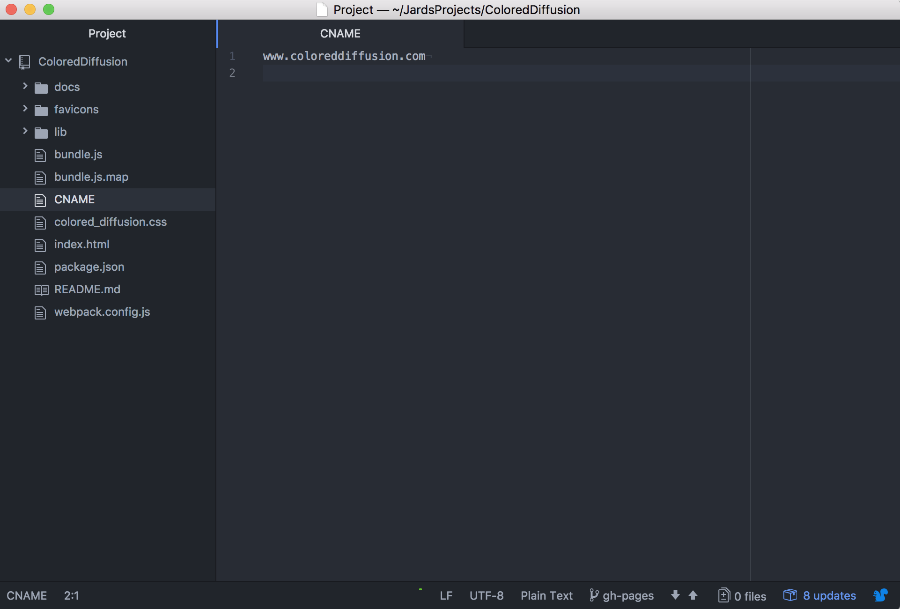

# Set up Custom Domain using Github Pages. No back-end!

This guide will let you set up a custom domain quickly for your front-end project that isn't attached to a back-end.

## Purchase Domain Name

+ Go to namecheap.com (You can use GoDaddy for domain names, but this guide will be using Namecheap.)

+ Purchase a nice domain name for your project :) Will manage the newly purchased domain later.

## Set Up Github Pages in your Github Repo

+ In the settings menu of your project repo, scroll down to the section called Github Pages.

+ Change the Source from **none** to **master** branch or **gh-pages** branch. It's recommended to create a gh-pages branch for github hosting, but it's up to you. Master works fine too.

+ Add the custom domain link that you purchased. ex: www.coloreddiffusion.com

## Set Up Cloudflare (Domain Name Service)

+ Cloudflare provides a free DNS service, and very fast and quick! Can use others like Amazon Cloudfront and MaxCDN, but those require to pay. Using Cloudflare allows your project sites to load instantly :) It's awesome.

+ Click +Add Site at the top. Enter your purchased domain url. ex) coloreddiffusion.com

+ After Cloudflare locates your site, manage the site's DNS records.

+ Add a new record. Choose DNS type: CNAME, Name: www, and the IPv4 address is {github username}.github.io. ex) johndoe123.github.io

## Connect Cloudflare routing to Namecheap.

+ Go back to namecheap. Click on Account on the top right, and navigate to Dashboard.

+ Click manage on your newly purchased site.

+ In nameservers, click custom DNS. Add the two cloudflare urls obtained. Mine were cass.ns.cloudflare.com and graham.ns.cloudflare.com. Yours should be similar.

## Attach CNAME to your github project.

+ Last Step!

+ In the root directory of your github repo, create a new file called CNAME

+ Inside CNAME, simply write the name of your custom domain.

+ Push to master or gh-pages branch (whichever is connected to the site)

### Done!

+ In ~20 minutes, your site can be seen at your new domain.

+ In the mean time, your site should be able to be seen at https://{github_username}.github.io/{repo_name}
