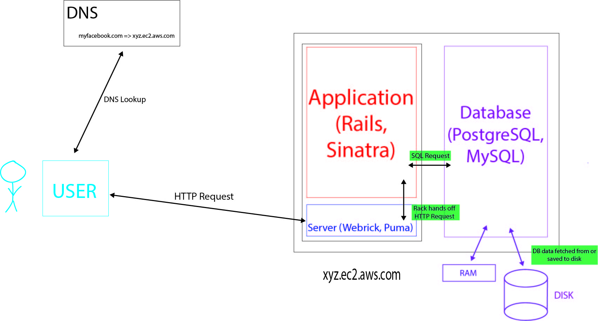
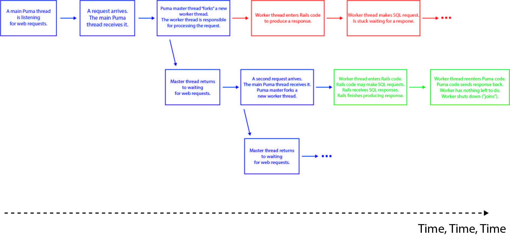
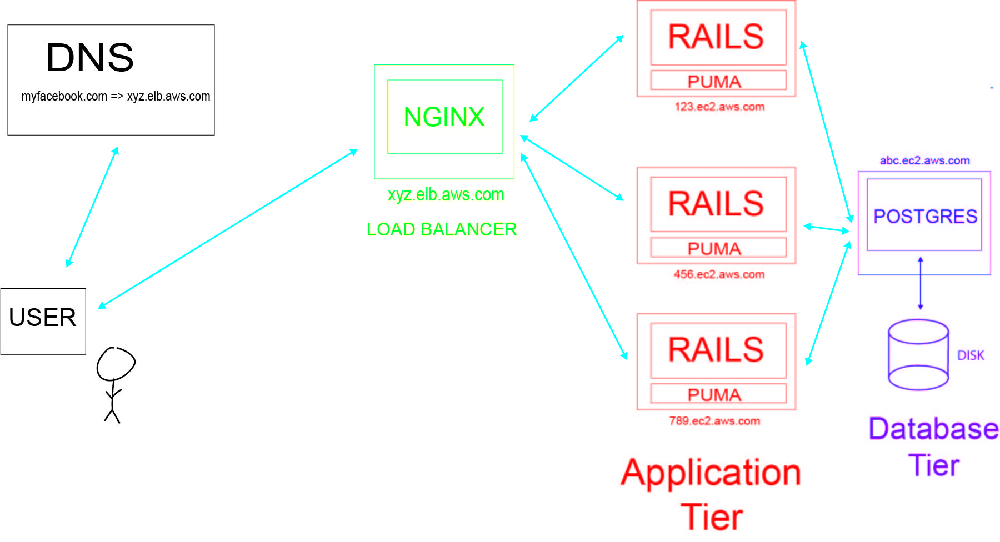

# Web Architecture (Part I)

### Basic Configuration of a Web App

The above image represents a simple set up of a web app. Let's imagine that we have a toy app called myfacebook.com. Let's observe how this app is set up:

1. When the user goes to the browser and types in "www.myfacebook.com", it instantiates a DNS lookup to find the correct IP address to get the website associated with that domain (you can think of DNS as a phone book for the internet).

2. Then, an HTTP request is made from the user to a web server. The web server's only job is to speak HTTP.

3. The web server does some processing on the request and hands it off to the app server (typically Puma; maybe Webrick in development). The app server uses Rack to communicate with the application (Rails, Sinatra) and then determines what to put in the body of the response back to the user.

4. Meanwhile, there's also a database server running (PostgreSQL in this example). The application talks to the database through a TCP connection. (Conceivably, the application and database servers could live on different machines, but for this simple set up, let's assume that they exist on the same machine.) The application sends SQL for the database to execute, and then the database sends the response back.

5. As the database executes the SQL, it makes read and write operations to the RAM (Random-access memory) and hard disk of the machine based on the SQL that the application sends. RAM is fast to read and write from, but it does not persist once the machine is turned off. On the other hand, data in the hard disk does persist, but operations are much slower.

### Basic App Performance
Let's analyze the performance of our basic web app, myfacebook.com, which was built on Rails and uses a PostgreSQL database.

#### Application (Rails)
In general, Ruby excutes slowly in comparison to other languages like C and Java.

One way you could boost the performance of your app is to configure Ruby to use the JRuby interpreter (which is written in Java) instead of its default MRI interpreter (which is written in C). JRuby is advantageous because it can run Ruby code in parallel (multi-threaded), and it can run Ruby code quicker. At the same time, one of the main downsides of JRuby is the slower start up time compared to MRI.

#### Web Application Server
Two common servers includes Webrick and Puma. Webrick is designed to be simple, and it's single-threaded. Single-threaded means if there are two requests, then the first one must finish executing before the second one can be handled. Therefore, it's quite slow and can only handle around 100 requests per second.

Puma, in contrast, is multi-threaded and can handled multiple requests at the same time. It's much faster than Webrick and can handle around 2k requests per second.

How Puma's multi-threading works:

#### Database (PostgreSQL)
Databases in general have very high read rates. PostgreSQL can make approximately 80k reads per second (only applies if the data is residing in the RAM). However, the write rate is much slower (about 2.5k writes per second for solid state disks; rotational drives is even slower). This is because PostgreSQL always needs to write to disk to achieve durability. When a machine is booted up, it stores as much of the data from the hard disk to the RAM as possible to improve the read performance.

### Scaling
Let's say our app, myfacebook.com, starts to grow in popularity, and our current configuration can no longer handle the larger amounts of requests. What can we do?``

#### Scaling up
The first option that we should always explore is **scaling up**, which is to make our machine more powerful. There are different ways to improve:
* Add more CPUs, faster CPUs, or CPUs with more cores. Specifically, this would improve application server and database performance
* Add more RAM. This would especially improve database read performance because it would allow for more data to be held in the RAM.
* Replace rotational disks with solid state disks, which would especially improve database write performance.

These improvements to the machine would only cost money and not require you to reconfigure the way your system is actually set up. This should be the first option explored because it's much better than needing to sink time into reconfiguring your infrastructure.

#### Scaling out
Once we've maxed out how powerful our one machine can be, the next step to explore is **scaling out**.

In this first implementation of scaling out, we would add more machines and distribute the work of the application server. Notice that we would not yet distribute the work of the database across multiple machines, but it does now have its own dedicated machine.

In this configuration, the user would still send out the HTTP request, but this time it first hits a load balancer (ie. NGINX), which distributes the work across the machines.

If you run your application servers on three different machines, then the load balancer would send approximately a third of requests to each one. All three machines are essentially clones of each other. Theoretically, you can now do 3 times the work you could before.

In terms of cost, the database box(machine) is typically very high-end and expensive since it's doing much heavier work. The application server machines, on the other hand, are less expensive because it's more cost-efficient to run more cheap boxes than a few expensive boxes.
